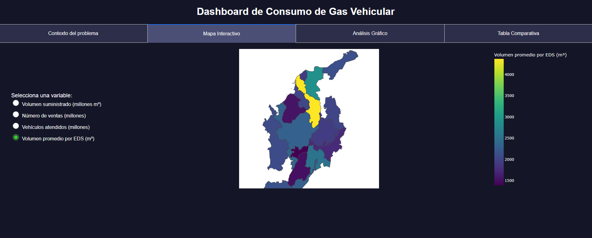

# 🚗💨 Dashboard de Consumo de Gas Vehicular en Colombia

Este proyecto es una aplicación web interactiva desarrollada con [Plotly Dash](https://dash.plotly.com/), que permite analizar el consumo de **Gas Natural Vehicular (GNV)** en Colombia. A través de mapas, gráficos y tablas comparativas, se visualiza el comportamiento por departamento, facilitando la toma de decisiones y el análisis regional.

---

## 🖼️ Vista previa

 <!-- Asegúrate de tener esta imagen en la carpeta assets -->

---

## 📊 Funcionalidades

✅ Visualización geoespacial del consumo de GNV por departamento  
✅ Análisis gráfico de volumen, ventas y vehículos atendidos  
✅ Comparación por eficiencia (volumen promedio por EDS)  
✅ Modo oscuro para una mejor experiencia visual  
✅ Tabs organizadas: Contexto del problema, Mapa, Gráficos y Tabla  

---

## 🗂️ Estructura del Proyecto

```
├── app.py                     # App principal en Dash
├── assets/                   # Estilos, imágenes, íconos
├── MGN_MPIO_POLITICO.*       # Archivos del shapefile (cartografía DANE)
├── ventas.csv                # Base de datos de consumo por municipio
├── mapa_dep.parquet          # Datos procesados (opcional)
├── requirements.txt          # Dependencias
└── README.md
```

---

## 🧪 Tecnologías utilizadas

- Python 3.10
- Dash & Plotly
- Pandas & GeoPandas
- Shapely
- Plotly Express
- HTML + CSS en modo dark
- Datos del DANE y SICOM

---

## ⚙️ Cómo ejecutar el proyecto

### 1. Clona el repositorio

```bash
git clone https://github.com/Nicoplayz58/geoespacial.git
cd geoespacial
```

### 2. Crea un entorno virtual (opcional pero recomendado)

```bash
python -m venv venv
venv\Scripts\activate  # En Windows
source venv/bin/activate  # En macOS/Linux
```

### 3. Instala las dependencias

```bash
pip install -r requirements.txt
```

### 4. Ejecuta la app

```bash
python app.py
```

Luego abre el navegador en:  
👉 http://localhost:8050/

---

## 🧠 Contexto del Proyecto

En Colombia, el uso del **Gas Natural Vehicular (GNV)** representa una alternativa eficiente, económica y amigable con el medio ambiente. Sin embargo, su adopción y consumo varía significativamente entre departamentos. Este dashboard permite analizar variables como:

- **Volumen suministrado**
- **Número de ventas**
- **Vehículos atendidos**
- **Eficiencia por estación de servicio (EDS)**

Toda la información se visualiza con soporte geoespacial gracias a los archivos shapefile del DANE.

---

## ✍️ Autor

**Nicolás**  
Estudiante de Ciencia de Datos – Universidad del Norte  
Desarrollado con 💙 para visualización interactiva y análisis geográfico.

---

## 🖼️ Créditos de los datos

- [SICOM](https://www.minminas.gov.co/sicom) – Sistema de Información de Combustibles  
- [DANE](https://www.dane.gov.co/) – Cartografía oficial de Colombia

---

## 📄 Licencia

Este proyecto es de uso libre para fines académicos y educativos.  
Distribúyelo con créditos si lo vas a compartir.